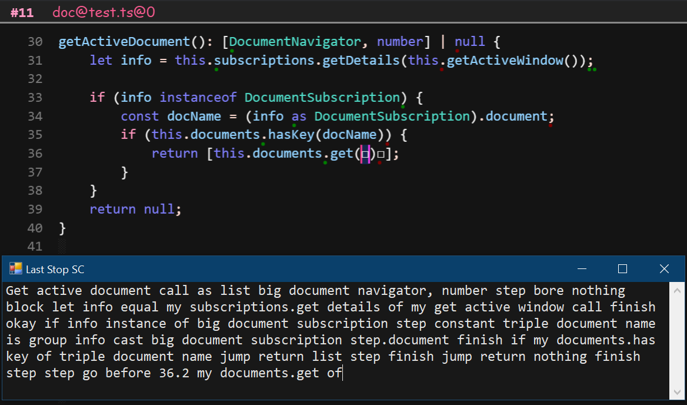

# Last Stop

Last Stop provides dictation-powered voice coding for programmers with RSIs or disabilities affecting their
ability to type.

This application is still under heavy feature development. It's usable today, but with a small
mountain of caveats and gotchas. Feature-complete alpha is expected in July 2020.

